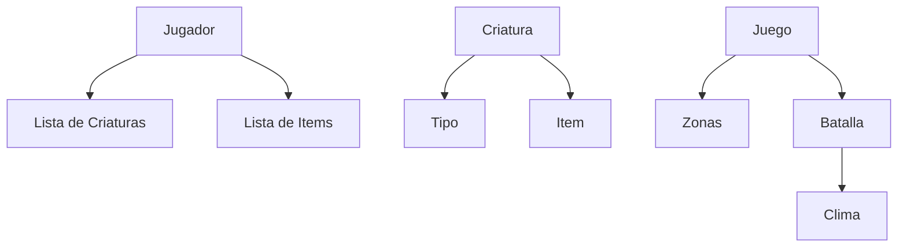

# Proyecto Aula POO — Juego de Criaturas por Turnos

Un videojuego de consola inspirado en la mecánica de Pokémon, desarrollado como proyecto académico para la asignatura de Programación Orientada a Objetos. El sistema permite explorar un mundo dinámico, gestionar un equipo de criaturas y participar en combates estratégicos.

---

## Estado Actual del Proyecto (game_state.py)

Actualmente, el proyecto cuenta con el motor base funcional que permite la navegación y el combate básico.

### Clases Implementadas

| Clase    | Responsabilidad                                                                            |
| :------- | :----------------------------------------------------------------------------------------- |
| Criatura | Entidad de combate. Gestiona estadísticas (HP, ATK) y lógica de daño aleatorio (±20%).     |
| Juego    | Controlador principal. Administra la posición del jugador, el equipo y el flujo principal. |

### Mecánicas Funcionales

- Navegación: Sistema de movimiento por puntos cardinales (Norte, Sur, Este, Oeste).
- Mapa Dinámico: 3 zonas iniciales (Pradera, Volcán, Lago) con biomas específicos.
- Encuentros Aleatorios: Probabilidad del 60% de avistar criaturas salvajes al explorar.
- Sistema de Combate: Batallas por turnos con flujo de ataque y contraataque.
- Interfaz de Usuario: Menús interactivos numerados para una navegación fluida en consola.

### Datos Base

- Criaturas: Ignis (Fuego), Torrente (Agua), Rocafer (Tierra), Voltex (Rayo).
- Equipo Inicial: El jugador comienza su aventura con Ignis.

> [!NOTA]
> Limitaciones actuales: El sistema de tipos aún no afecta el daño, el equipo es fijo (no hay captura) y no existen objetos consumibles.

---

## Visión Futura (Análisis de Diseño)

El diseño del sistema está pensado para expandirse mediante principios de POO, incorporando las siguientes entidades:

### Entidades a Implementar

| Clase   | Atributos Clave               | Responsabilidad                                   |
| :------ | :---------------------------- | :------------------------------------------------ |
| Jugador | nombre, equipo[], posicion    | Gestión de inventario y progresión.               |
| Tipo    | nombre, multiplicadores[]     | Lógica de ventajas y desventajas elementales.     |
| Item    | nombre, efecto, penalizador   | Objetos estratégicos con balance costo-beneficio. |
| Batalla | turno, clima                  | Orquestador del flujo de combate complejo.        |
| Clima   | modificadores, tiposAfectados | Alteración de stats según el entorno.             |

### Sistema Elemental (Efectividad)

Multiplicador de ×1.5 en ataques efectivos:

- Fuego: Gana a Tierra/Rayo | Teme a Agua/Tierra.
- Agua: Gana a Fuego/Tierra | Teme a Rayo/Tierra.
- Tierra: Gana a Agua/Fuego | Teme a Fuego/Rayo.
- Rayo: Gana a Agua | Teme a Fuego/Tierra.

### Condiciones Climáticas en Combate

| Clima    | Beneficia   | Perjudica    | Efecto Especial                |
| :------- | :---------- | :----------- | :----------------------------- |
| Tormenta | Rayo/Agua   | Tierra/Fuego | +20% Precisión                 |
| Arena    | Tierra      | Fuego/Agua   | +20% Def / -15% Precisión      |
| Calor    | Fuego       | Agua/Tierra  | +25% Atk / Daño residual Agua  |
| Lluvia   | Agua/Tierra | Fuego/Rayo   | +20% Atk / Daño residual Fuego |

---

## Hoja de Ruta (Requirements)

- [ ] RF1: Personalización del nombre del jugador.
- [ ] RF3: Implementación del sistema de captura de criaturas salvajes.
- [ ] RF5: Menú de combate expandido (Atacar, Ítem, Huir).
- [ ] RF6: Sistema de equipo de ítems (1 Slot por criatura).
- [ ] RF8: Sistema de experiencia y subida de nivel.
- [ ] RF10: Persistencia de datos (Guardado y carga de partida).

---

## Arquitectura del Sistema



---

## Ejecución y Requisitos

Para iniciar el juego, ejecuta el siguiente comando en tu terminal:

```bash
python game_state.py
```

- Requisitos: Python 3.10 o superior.
- Paradigma: 100% Orientado a Objetos.
- Interfaz: Consola interactiva con opciones numeradas — el jugador siempre sabe qué puede hacer.
- Extensibilidad: Diseñado para agregar nuevos tipos, climas o ítems sin modificar el motor de combate.
