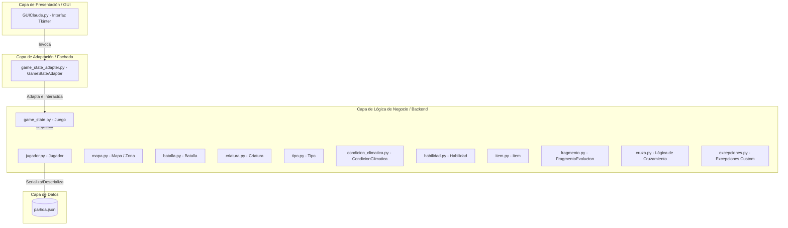
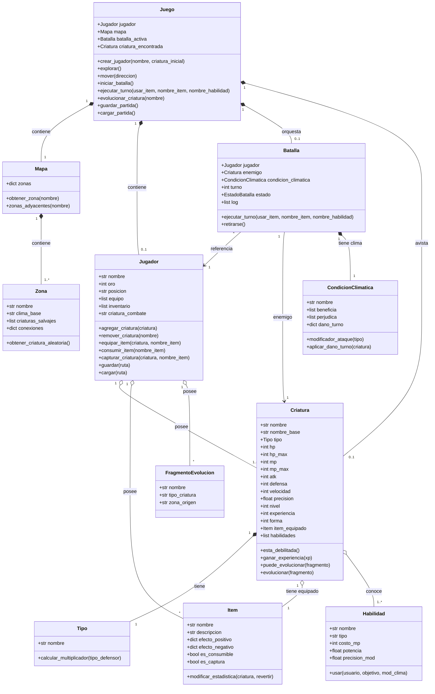
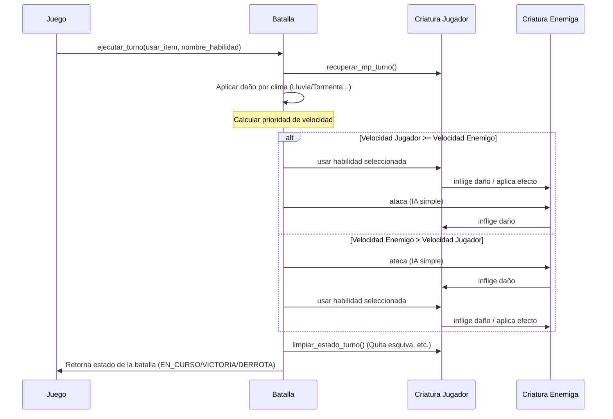
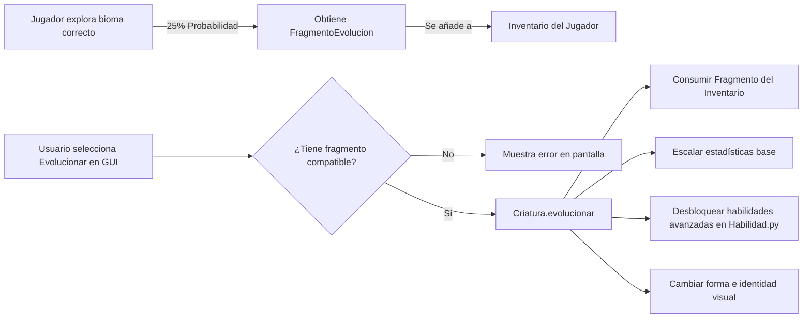

# 🎮 Proyecto Aula POO — Juego de Criaturas por Turnos

[](https://www.python.org/)
[](https://en.wikipedia.org/wiki/Object-oriented_programming)
[](https://docs.python.org/3/library/tkinter.html)

Un videojuego de combate y exploración por turnos desarrollado bajo el paradigma de **Programación Orientada a Objetos (POO)**. Este proyecto académico implementa una arquitectura robusta y desacoplada, separando la lógica de negocio (Backend) de la interfaz gráfica de usuario (Frontend). El juego permite a los jugadores explorar biomas interactivos, capturar criaturas, equipar ítems estratégicos, cruzar elementos para obtener híbridos únicos y evolucionar a sus compañeros.

Para un análisis técnico más detallado de la arquitectura de software, los patrones de diseño aplicados y los diagramas de secuencia del sistema, consulta el documento de [arquitectura_proyecto.md](file:///c:/Users/shado/Documents/Proyecto_Aula_POO/Proyecto_aula_POO/arquitectura_proyecto.md).

---

## 🌟 Características Principales

*   **🗺️ Exploración y Biomas**: Navegación por mapas de nodos ([Mapa](file:///c:/Users/shado/Documents/Proyecto_Aula_POO/Proyecto_aula_POO/mapa.py) y [Zona](file:///c:/Users/shado/Documents/Proyecto_Aula_POO/Proyecto_aula_POO/mapa.py)) que representan diferentes biomas (Pradera, Volcán, Lago, Cueva de Roca, Cumbre Nevada) con climas predeterminados y tasas de encuentro de criaturas personalizadas.
*   **⚔️ Combate por Turnos**: Lógica de batalla ([Batalla](file:///c:/Users/shado/Documents/Proyecto_Aula_POO/Proyecto_aula_POO/batalla.py)) que calcula turnos basados en la velocidad, costos de MP, multiplicadores de ventaja de tipos y los efectos climatológicos del bioma.
*   **🧬 Cruzamiento Híbrido (Breeding)**: Permite combinar dos criaturas elementales ([cruza.py](file:///c:/Users/shado/Documents/Proyecto_Aula_POO/Proyecto_aula_POO/cruza.py)) para procrear una criatura híbrida (ej. Fuego × Agua -> Vapor, Hielo × Rayo -> Aurora) heredando afinidades pasivas y con un 5% de probabilidad de generar mutaciones con estadísticas mejoradas.
*   **⚡ Sistema de Evolución**: Consumo de fragmentos de evolución ([FragmentoEvolucion](file:///c:/Users/shado/Documents/Proyecto_Aula_POO/Proyecto_aula_POO/fragmento.py)) que se obtienen al explorar biomas (25% drop rate) para transformar las criaturas en formas de combate avanzadas, escalando estadísticas y desbloqueando habilidades adicionales.
*   **🎒 Inventario y Equipamiento**: Gestión de objetos ([Item](file:///c:/Users/shado/Documents/Proyecto_Aula_POO/Proyecto_aula_POO/item.py)) equipables de doble filo (ofrecen mejoras y penalizaciones simultáneas) y consumibles (pócimas y trampas de captura).
*   **💾 Persistencia de Datos**: Guardado y carga de la partida ([partida.json](file:///c:/Users/shado/Documents/Proyecto_Aula_POO/Proyecto_aula_POO/partida.json)) en formato JSON de forma automática e integrada.

---

## 🏗️ Visión General de la Arquitectura

El sistema está estructurado bajo un enfoque desacoplado de tres capas:


```mermaid
graph TD
    subgraph Frontend [Capa de Presentación / GUI]
        GUI[GUIClaude.py - Interfaz Tkinter]
    end

    subgraph Adapter [Capa de Adaptación / Fachada]
        GSA[game_state_adapter.py - GameStateAdapter]
    end

    subgraph Backend [Capa de Lógica de Negocio / Backend]
        Juego[game_state.py - Juego]
        Jugador[jugador.py - Jugador]
        Mapa[mapa.py - Mapa / Zona]
        Batalla[batalla.py - Batalla]
        Criatura[criatura.py - Criatura]
        Tipo[tipo.py - Tipo]
        Clima[condicion_climatica.py - CondicionClimatica]
        Habilidad[habilidad.py - Habilidad]
        Item[item.py - Item]
        Fragmento[fragmento.py - FragmentoEvolucion]
        Cruza[cruza.py - Lógica de Cruzamiento]
        Excepciones[excepciones.py - Excepciones Custom]
    end

    subgraph Persistencia [Capa de Datos]
        JSON[(partida.json)]
    end

    GUI -->|Invoca| GSA
    GSA -->|Adapta e interactúa| Juego
    Juego -->|Orquesta| Backend
    Jugador -->|Serializa/Deserializa| JSON
```

---

## 📂 Estructura del Proyecto

El código está estructurado en los siguientes módulos y archivos:

### Capa de Presentación (Frontend)
*   **[GUIClaude.py](file:///c:/Users/shado/Documents/Proyecto_Aula_POO/Proyecto_aula_POO/GUIClaude.py)**: Interfaz gráfica desarrollada en Tkinter que implementa pantallas dinámicas para el menú principal, mapas, equipo de criaturas, combate por turnos, tienda de ítems, cruzas y evolución.

### Capa de Adaptación (Facade)
*   **[game_state_adapter.py](file:///c:/Users/shado/Documents/Proyecto_Aula_POO/Proyecto_aula_POO/game_state_adapter.py)**: Define la clase [GameStateAdapter](file:///c:/Users/shado/Documents/Proyecto_Aula_POO/Proyecto_aula_POO/game_state_adapter.py). Actúa como fachada y adaptador de la información cruda del backend para el consumo plano del frontend (formateando a strings, emojis y códigos de color de interfaz).

### Capa de Lógica de Negocio (Backend)
*   **[game_state.py](file:///c:/Users/shado/Documents/Proyecto_Aula_POO/Proyecto_aula_POO/game_state.py)**: Contiene la clase [Juego](file:///c:/Users/shado/Documents/Proyecto_Aula_POO/Proyecto_aula_POO/game_state.py), que orquesta el flujo global del backend: cambios de zona, batallas, persistencia y catálogos globales.
*   **[jugador.py](file:///c:/Users/shado/Documents/Proyecto_Aula_POO/Proyecto_aula_POO/jugador.py)**: Contiene la clase [Jugador](file:///c:/Users/shado/Documents/Proyecto_Aula_POO/Proyecto_aula_POO/jugador.py) que gestiona el inventario de ítems, fragmentos, el equipo de hasta 6 criaturas, oro e integra la persistencia a JSON.
*   **[criatura.py](file:///c:/Users/shado/Documents/Proyecto_Aula_POO/Proyecto_aula_POO/criatura.py)**: Implementa la clase [Criatura](file:///c:/Users/shado/Documents/Proyecto_Aula_POO/Proyecto_aula_POO/criatura.py) con sus estadísticas base, fórmulas de daño, ganancia de experiencia y evolución mediante el árbol de evoluciones.
*   **[tipo.py](file:///c:/Users/shado/Documents/Proyecto_Aula_POO/Proyecto_aula_POO/tipo.py)**: Define la clase [Tipo](file:///c:/Users/shado/Documents/Proyecto_Aula_POO/Proyecto_aula_POO/tipo.py), estructurando las relaciones de ventajas y desventajas elementales de daño.
*   **[habilidad.py](file:///c:/Users/shado/Documents/Proyecto_Aula_POO/Proyecto_aula_POO/habilidad.py)**: Define la clase [Habilidad](file:///c:/Users/shado/Documents/Proyecto_Aula_POO/Proyecto_aula_POO/habilidad.py) y clasifica las acciones de combate en ataque físico/elemental, especial (penetra defensa), esquivar y soporte.
*   **[item.py](file:///c:/Users/shado/Documents/Proyecto_Aula_POO/Proyecto_aula_POO/item.py)**: Implementa la clase [Item](file:///c:/Users/shado/Documents/Proyecto_Aula_POO/Proyecto_aula_POO/item.py) que contiene los modificadores pasivos y la lógica de consumibles de curación y captura.
*   **[fragmento.py](file:///c:/Users/shado/Documents/Proyecto_Aula_POO/Proyecto_aula_POO/fragmento.py)**: Modela [FragmentoEvolucion](file:///c:/Users/shado/Documents/Proyecto_Aula_POO/Proyecto_aula_POO/fragmento.py) y sus restricciones de biomas.
*   **[cruza.py](file:///c:/Users/shado/Documents/Proyecto_Aula_POO/Proyecto_aula_POO/cruza.py)**: Implementa el algoritmo de cruzamiento para fusionar estadísticas y heredar afinidades pasivas.
*   **[mapa.py](file:///c:/Users/shado/Documents/Proyecto_Aula_POO/Proyecto_aula_POO/mapa.py)**: Estructura las clases [Mapa](file:///c:/Users/shado/Documents/Proyecto_Aula_POO/Proyecto_aula_POO/mapa.py) y [Zona](file:///c:/Users/shado/Documents/Proyecto_Aula_POO/Proyecto_aula_POO/mapa.py) para modelar la navegación basada en un grafo interactivo.
*   **[batalla.py](file:///c:/Users/shado/Documents/Proyecto_Aula_POO/Proyecto_aula_POO/batalla.py)**: Implementa la clase [Batalla](file:///c:/Users/shado/Documents/Proyecto_Aula_POO/Proyecto_aula_POO/batalla.py) que orquesta las fases del combate por turnos.
*   **[condicion_climatica.py](file:///c:/Users/shado/Documents/Proyecto_Aula_POO/Proyecto_aula_POO/condicion_climatica.py)**: Modela [CondicionClimatica](file:///c:/Users/shado/Documents/Proyecto_Aula_POO/Proyecto_aula_POO/condicion_climatica.py) para aplicar penalizaciones y bonificaciones en batalla según el entorno.
*   **[excepciones.py](file:///c:/Users/shado/Documents/Proyecto_Aula_POO/Proyecto_aula_POO/excepciones.py)**: Contiene la definición de excepciones personalizadas para controlar el flujo de juego y evitar inconsistencias en el backend.

---

## 🎨 Patrones de Diseño Aplicados

1.  **Fachada y Adaptador (Facade / Adapter)**: La clase [GameStateAdapter](file:///c:/Users/shado/Documents/Proyecto_Aula_POO/Proyecto_aula_POO/game_state_adapter.py) funciona como fachada centralizada de comunicación y adapta las entidades complejas del backend para que la interfaz gráfica en Tkinter no tenga acoplamiento directo con la lógica de negocio.
2.  **Estrategia / Polimorfismo por Duck-Typing**: Los efectos de los ítems y las habilidades se calculan mediante polimorfismo dinámico (`Item.modificar_estadistica` y `Habilidad.usar`), permitiendo que el motor de combate procese acciones de forma genérica.
3.  **Separación de Responsabilidades (MVC-like)**: Arquitectura desacoplada dividida en Vista ([GUIClaude.py](file:///c:/Users/shado/Documents/Proyecto_Aula_POO/Proyecto_aula_POO/GUIClaude.py)), Controlador/Adaptador ([game_state_adapter.py](file:///c:/Users/shado/Documents/Proyecto_Aula_POO/Proyecto_aula_POO/game_state_adapter.py)) y Modelo (núcleo del backend).

---

## 🧬 Diagrama de Clases UML


```mermaid
classDiagram
    class Juego {
        +Jugador jugador
        +Mapa mapa
        +Batalla batalla_activa
        +Criatura criatura_encontrada
        +crear_jugador(nombre, criatura_inicial)
        +explorar()
        +mover(direccion)
        +iniciar_batalla()
        +ejecutar_turno(usar_item, nombre_item, nombre_habilidad)
        +evolucionar_criatura(nombre)
        +guardar_partida()
        +cargar_partida()
    }

    class Jugador {
        +str nombre
        +int oro
        +str posicion
        +list equipo
        +list inventario
        +str criatura_combate
        +agregar_criatura(criatura)
        +remover_criatura(nombre)
        +equipar_item(criatura, nombre_item)
        +consumir_item(nombre_item)
        +capturar_criatura(criatura, nombre_item)
        +guardar(ruta)
        +cargar(ruta)
    }

    class Criatura {
        +str nombre
        +str nombre_base
        +Tipo tipo
        +int hp
        +int hp_max
        +int mp
        +int mp_max
        +int atk
        +int defensa
        +int velocidad
        +float precision
        +int nivel
        +int experiencia
        +int forma
        +Item item_equipado
        +list habilidades
        +esta_debilitada()
        +ganar_experiencia(xp)
        +puede_evolucionar(fragmento)
        +evolucionar(fragmento)
    }

    class Tipo {
        +str nombre
        +calcular_multiplicador(tipo_defensor)
    }

    class Habilidad {
        +str nombre
        +str tipo
        +int costo_mp
        +float potencia
        +float precision_mod
        +usar(usuario, objetivo, mod_clima)
    }

    class Item {
        +str nombre
        +str descripcion
        +dict efecto_positivo
        +dict efecto_negativo
        +bool es_consumible
        +bool es_captura
        +modificar_estadistica(criatura, revertir)
    }

    class FragmentoEvolucion {
        +str nombre
        +str tipo_criatura
        +str zona_origen
    }

    class Mapa {
        +dict zonas
        +obtener_zona(nombre)
        +zonas_adyacentes(nombre)
    }

    class Zona {
        +str nombre
        +str clima_base
        +list criaturas_salvajes
        +dict conexiones
        +obtener_criatura_aleatoria()
    }

    class Batalla {
        +Jugador jugador
        +Criatura enemigo
        +CondicionClimatica condicion_climatica
        +int turno
        +EstadoBatalla estado
        +list log
        +ejecutar_turno(usar_item, nombre_item, nombre_habilidad)
        +retirarse()
    }

    class CondicionClimatica {
        +str nombre
        +list beneficia
        +list perjudica
        +dict dano_turno
        +modificador_ataque(tipo)
        +aplicar_dano_turno(criatura)
    }

    Juego "1" *-- "1" Mapa : contiene
    Juego "1" *-- "0..1" Jugador : contiene
    Juego "1" *-- "0..1" Batalla : orquesta
    Juego "1" *-- "0..1" Criatura : avista

    Jugador "1" o-- "1..6" Criatura : posee
    Jugador "1" o-- "*" Item : posee
    Jugador "1" o-- "*" FragmentoEvolucion : posee

    Criatura "1" *-- "1" Tipo : tiene
    Criatura "1" o-- "1" Item : tiene equipado
    Criatura "1" o-- "1..*" Habilidad : conoce

    Mapa "1" *-- "1..*" Zona : contiene

    Batalla "1" --> "1" Jugador : referencia
    Batalla "1" --> "1" Criatura : enemigo
    Batalla "1" *-- "1" CondicionClimatica : tiene clima
```

*Adicionalmente, se puede consultar el diagrama UML de relaciones:*


---

## 🚀 Requisitos y Configuración de Ejecución

### Requisitos del Sistema
*   **Python**: Versión 3.10 o superior.
*   **Librerías**: `tkinter` (incluida en la biblioteca estándar de Python).

### Ejecución de la Interfaz Gráfica (Recomendado)
Para jugar con la interfaz de Tkinter:
```bash
python GUIClaude.py
```

### Compilación y Construcción del Ejecutable (.exe)
El proyecto incluye un script de compilación automática para Windows mediante `PyInstaller`:

1.  Instala PyInstaller en tu entorno:
    ```bash
    pip install pyinstaller
    ```
2.  Ejecuta el script por lotes provisto ([build_exe.bat](file:///c:/Users/shado/Documents/Proyecto_Aula_POO/Proyecto_aula_POO/build_exe.bat)):
    ```bash
    build_exe.bat
    ```
    *O bien, ejecuta el comando manual en la terminal usando la especificación [CriaturasPOO.spec](file:///c:/Users/shado/Documents/Proyecto_Aula_POO/Proyecto_aula_POO/CriaturasPOO.spec):*
    ```bash
    pyinstaller --clean --noconfirm CriaturasPOO.spec
    ```
3.  El ejecutable resultante se ubicará en la carpeta `dist/CriaturasPOO.exe`.
4.  La persistencia de datos ([partida.json](file:///c:/Users/shado/Documents/Proyecto_Aula_POO/Proyecto_aula_POO/partida.json)) se generará automáticamente en el mismo directorio donde se ejecute.

### Ejecución del Motor en Consola (Pruebas del Core)
Para interactuar con la lógica del juego directamente en terminal sin usar la interfaz gráfica:
```bash
python game_state.py
```

---

## 🔄 Flujos de Trabajo Principales

### A. Ejecución del Turno de Batalla

```mermaid
sequenceDiagram
    participant J as Juego
    participant B as Batalla
    participant CJ as Criatura Jugador
    participant CE as Criatura Enemiga

    J->>B: ejecutar_turno(usar_item, nombre_habilidad)
    B->>CJ: recuperar_mp_turno()
    B->>B: Aplicar daño por clima (Lluvia/Tormenta...)
    Note over B: Calcular prioridad de velocidad
    alt Velocidad Jugador >= Velocidad Enemigo
        B->>CJ: usar habilidad seleccionada
        CJ->>CE: inflige daño / aplica efecto
        B->>CE: ataca (IA simple)
        CE->>CJ: inflige daño
    else Velocidad Enemigo > Velocidad Jugador
        B->>CE: ataca (IA simple)
        CE->>CJ: inflige daño
        B->>CJ: usar habilidad seleccionada
        CJ->>CE: inflige daño / aplica efecto
    end
    B->>CJ: limpiar_estado_turno() (Quita esquiva, etc.)
    B->>J: Retorna estado de la batalla (EN_CURSO/VICTORIA/DERROTA)
```

### B. Proceso de Evolución

```mermaid
graph LR
    A[Jugador explora bioma correcto] -->|25% Probabilidad| B[Obtiene FragmentoEvolucion]
    B -->|Se añade a| C[Inventario del Jugador]
    D[Usuario selecciona Evolucionar en GUI] --> E{¿Tiene fragmento compatible?}
    E -->|No| F[Muestra error en pantalla]
    E -->|Sí| G[Criatura.evolucionar]
    G --> H[Consumir Fragmento del Inventario]
    G --> I[Escalar estadísticas base]
    G --> J[Desbloquear habilidades avanzadas en Habilidad.py]
    G --> K[Cambiar forma e identidad visual]
```
